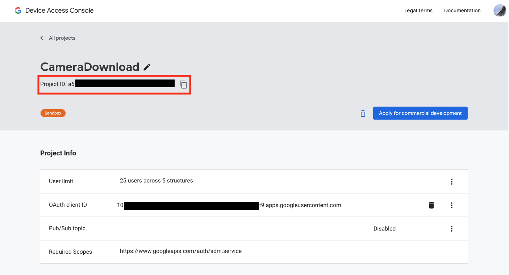
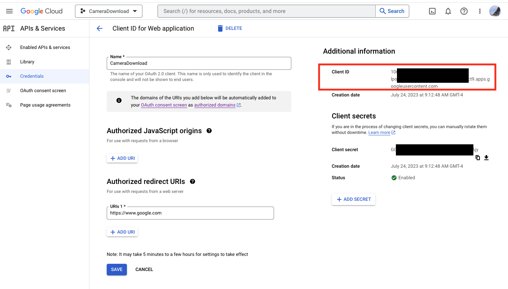
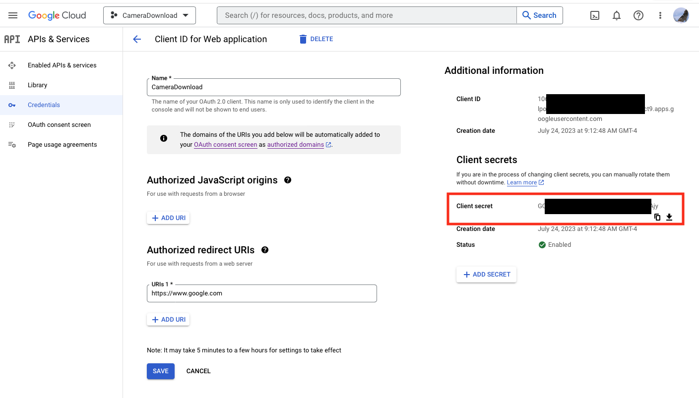
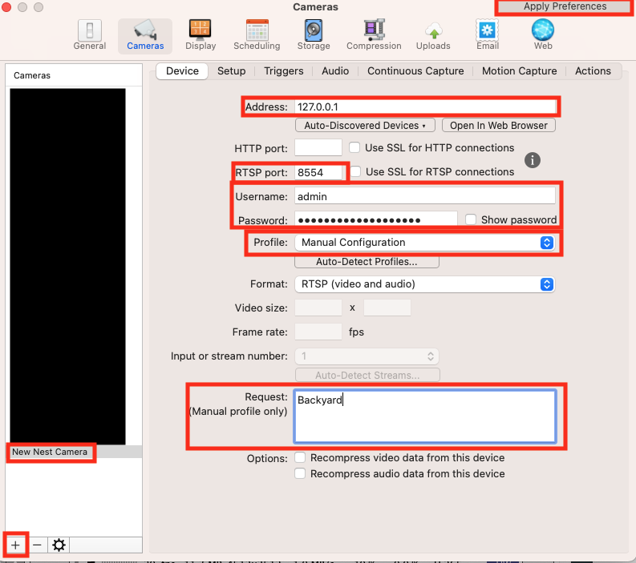

# google_nest_camera_proxy

Proxy your Nest Camera through `mediamtx` so you can view it on any RTSP reader.

## How Google Nest Cameras Work

Unfortunately, Google does not let you just connect to an RTSP stream, or even an RTSPS string, and read your cameras. It is much more complicated than that. There are a few hoops that you have to jump through:
1) Go through the Google Device Access Registration Process
2) Get your Google Authentication Tokens
3) Create your configuration files
4) Install mediamtx
5) Run the google-nest-camera-proxy application

Once this process is running what it does is reaches out to Google and gets an authentication token for the RTSPS stream, however that token only lasts for 5 minutes. It also includes an extension token, and this code will extend the token every 4 minutes so that you can record a continuous stream.

## Google Device Access Registration Process 


This is a fairly onerous process, so make sure to read the details before you begin. (*There is some more nice documentation of going through the process with screenshots at https://geoffhudik.com/tech/2023/03/04/trying-google-nest-api-with-postman-and-python/*) 


The biggest roadblock is that access to this API requires registering with Google for Device Access https://developers.google.com/nest/device-access/registration. This has a one time $5 fee.

The documentation https://developers.google.com/nest/device-access/get-started walks you through the rest of the process.

I'm not going to cover all the details on how to get this done, because it is documented better elsewhere. Some addition documentation from Google about using their APIs is here:
- https://developers.google.com/nest/device-access/authorize
- https://developers.google.com/nest/device-access/use-the-api
- https://developers.google.com/nest/device-access/api/thermostat

## Installation

1) You need to install `mediamtx`, which you can download at https://github.com/bluenviron/mediamtx. This is the rtsp proxy that I use to translate from Google RTSPS to RTSP. Make a note of where you install it for the configuration file
2) Install this module
```bash 
$ pip install google_nest_camera_proxy
```
3) Edit the configuration file, whose default location is `~/.config/nest/config`. See the Configuration section below for the details. 


### Basic Instructions 
 
These instructions were taken from the python-google-nest package (https://pypi.org/project/python-google-nest/) which provides the underlying libraries that I use to connect to the cameras. At a high level it involves:
1) Making sure your Nest devices are linked to your Google account 
2) Set up GCP (Google Cloud Platform) account https://console.cloud.google.com/
3) Set up a new GCP project 
   1) Create an Oauth landing page and add your email as a test user 
   2) Enable the Smart device management API
   3) Create an Oauth credential with the settings called from web server and https://www.google.com as the authorized redirect URI. Note the client ID and secret from this step.
4) In https://console.nest.google.com/device-access create a new project and add oauth client ID from step 3.3
5) Follow the series of queries in https://developers.google.com/nest/device-access/authorize to authorize devices. Note This step handled by this library.

Be careful as you follow along the guide in https://developers.google.com/nest/device-access/get-started, since you're dealing with so many similar accounts and keys it can be easy to mix something up, and you won't get particularly useful errors.

You should end up with the following pieces of information:

- project_id
   : ID of the project you created in https://console.nest.google.com/device-access 

- client_id
   : value from setting up OAuth in https://console.cloud.google.com/ project 

- client_secret
   : value from setting up OAuth in https://console.cloud.google.com/ project 


You will need those values in the next section.

## Configuration

You need to create a confiuration file with the authentication details, and information about setting up the `mediamtx` server. Below is a sample file:

```
[AUTH]
    client_id = MYCLIENTID
    client_secret = MYSECRET
    project_id = MYPROJECTID
    access_token_cache_file = /Users/ME/.config/nest/token_cache

[RTSP_SERVER]
    executable = /usr/local/bin/mediamtx
    config_filename = /Users/ME/.config/nest/rtsp.yml

```
client_id
   : This is the client_id from your project (from the credentials page on the Google console)

client_secret
   : The client secret (from the credentials page on the Google console)

project_id
   : The project ID (from the project page on the Google console)

access_token_cache_file 
   : Where the token cache is stored

executable
   : The location you installed the `mediamtx` executable.

config_filename
   : The location of the `mediamtx` configuration file. This program adds all the cameras to the configuration file

### Authentication

As part of the pyhon-google-nest package installation that is a dependency of this project, it creates a `nest` application. The first time you run `nest show` it will tell you to go to a URL (https://nestservices.google.com/partnerconnections with some parameters), and then you will step through selecting and authorizing the cameras that you want to stream. When you finish this process your browser will have a URL that looks like https://www.google.com/?state=SOME_STATE_VALUE&code=SOME_AUTHENTICATION_CODE&scope=https://www.googleapis.com/auth/sdm.service that you need to copy and paste into the callback, which is then stored  in the ~/.config/nest/token_cache file.

## Usage

```
Usage: google-nest-camera-proxy [OPTIONS]

  Configures the proxy rtsp server, and keeps it updated

  CONFIGURATION
  -------------
  The configuration file looks like this:

  [AUTH]
      client_id = client_id from Google
      client_secret = client secret from Google
      project_id = project id from Google
      access_token_cache_file = /Users/ME/.config/nest/token_cache

  [RTSP_SERVER]
      executable = /usr/local/bin/rtsp-simple-server
      config_filename = /Users/ME/.config/nest/rtsp

      See the README.md file to see how to get those values.

Options:
  -c, --configuration-file PATH  Where the configuration for this program is
                                 located
  -v, --verbose                  Turn on more informational output
  -d, --debug                    Turn on debugging output
  -n, --no-server                Update the file, but don't run the mediamtx
                                 server as a subprocess
  --help                         Show this message and exit.

```

## `mediamtx` Configuration

`mediamtx` comes with a default configuration file that you can leave alone except for changing a few parameters. The only ones you *have* to change are `readUser` and `readPass`. You should put in a username and password, and those will need to be provided to the program that reads the camera. 

In addition, `mediamtx` provides a lot of options that you won't need, so you can turn them off. This is optional, but here are my settings for these fields:

```ini
protocols: [tcp]
rtmp: no
hls: no
webrtc: no
```

When you run `google-nest-camera-proxy` it regularly modifies the `mediamtx` configuration file, adding the camera configuration to the bottom of it. Do not edit below this line"

```
# NEST EDITS BELOW -- DO NOT EDIT THIS LINE OR BELOW
```
## Configuring SecuritySpy

I have found SecuritySpy (https://bensoftware.com/securityspy/) the best product to view and record cameras. To configure SecuritySpy to view the cameras:

- Open Settings in SecuritySpy
- Go to the Cameras tab
- On the bottom left, hit the `+` and select `Add Network Device`
- In the `Address` box, put the IP address of the box that is running the `mtxmedia` server. In my case, I use 127.0.0.1, since both the server and SecuritySpy are running on the same host
- Unless you've changed the `rtspAddress` parameter in the `mediamtx.yml` file, put `8554` in the `RTSP port` box.
- Select `Manual Profile` from the `Profile` dropdown. 
- If you look in the `mediamtx.yml` file at the bottom, there are lines that look like this. The tag is the name of the camera, and the source is the rtsps stream that changes regularly. Use the name in the file as the name of the camera, and put it in the `Request` box.
```ini
  Backyard:
    source: rtsps://stream-ue1-bravo.dropcam.com:443/sdm_live_stream/CiUA2vuxr2D61w4Y5ZU2awZvBxZoVD5zE-WgFM5ofLJiMML9NnXLEnEAEGF6Sh1PFqMRG4ynOX1qGu4MgBGjmBwDHgWpkCsHKWybOA?auth=g.0.eyJraWQiOiIyMzhiNTUxZmMyM2EyM2Y4M2E2ZTE3MmJjZTg0YmU3ZjgxMzAzMmM4IiwiYWxnIjoiUlMyNTYifQ.eyJpc3MBhaOhZ0Y5utipHFESKsG4499KfxIs_xuQ8HF1f6vzicaQ9zBGu3yFAWq6bx5hkd5rcrJRmRDjTgfKO96fy9UIYZZAmJptW9r8KGw
    readUser: admin
    readPass: mysecurepassword


  FrontDoor:
    source: rtsps://stream-us1-foxtrot.dropcam.com:443/sdm_live_stream/CiUA2vuxr32E11B1alS1QRyq7w4mwEX8NRJEhMnJ_m2mTO9EiXXCEnEAEGF6SmAHpELf7bUIco7Dx3enLdzFi5I?auth=g.0.eyJraWQiOiIyMzhiNTUxZmMyM2EyM2Y4M2E2ZTE3MmJjZTg0YmU3ZjgxMzAzMmM4IiwiYWxnIjoiUlMyNTYifQ.eyJpc3MiOiJuZXN0LXNlY3VyaXR5LWF1dGhwcm94eSIsInN1YiI6Im5lc3RfaWQ6bmVzdC1waG9lbml4LXByb2Q6MTQxNDQwMSIsInBvbCI6IjNwLW9hdXRoLXNjb3BlLUFQSV9TRE1fU0VSVklDNzfcmq51D5VEk8P8ksPEeUNld-xl7BgO0844T-FjXMk7MKqMDYoum6qwYYwtwVGSP5V0KkMgg50E8PP_rUfm6bKp4KG2i50PGxcNOWFi2Uz0EVH1Q8rmCfX6TWHJb-n3I9I2XH6zv3Z-zjLba7fxvSdgmMjPgRfEF61xNOwnOkja3lqva7I6cWkw
    readUser: admin
    readPass: mysecurepassword
```
 

- Click `Apply Preferences` and in just a few minutes it should start receiving the video.

## Contributing

Interested in contributing? Check out the contributing guidelines. Please note that this project is released with a Code of Conduct. By contributing to this project, you agree to abide by its terms.

## License

`google_nest_camera_proxy` was created by Xev Gittler. It is licensed under the terms of the MIT license.

## Credits

`google_nest_camera_proxy` was created with [`cookiecutter`](https://cookiecutter.readthedocs.io/en/latest/) and the `py-pkgs-cookiecutter` [template](https://github.com/py-pkgs/py-pkgs-cookiecutter).
